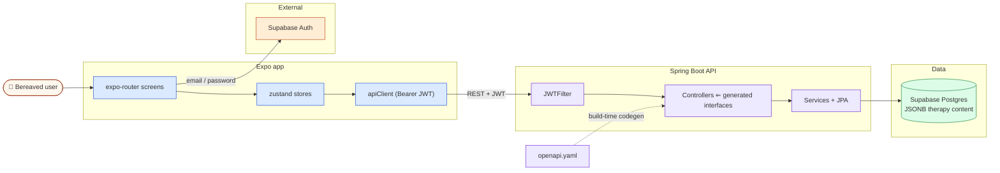

# Practising Good Grief

> Grief support happens one hour a week in a counsellor's office — if it happens at all. Practising Good Grief turns a therapist-designed grief curriculum into a guided mobile program: a gated intake assessment, once-a-day check-ins, a CBT-framed journal, and a library of structured activities grounded in established grief-therapy models.

<!-- TODO(media): hero screenshot strip or 20-sec GIF — onboarding → daily check-in → activities -->

## Why this exists

Someone three months after a loss doesn't need another meditation app. Grief work has well-studied structure — the Dual Process Model of oscillating between loss-oriented and restoration-oriented coping, safety planning, trigger mapping — but that structure lives in printed worksheets and a weekly session, while the hard hours happen everywhere else.

This app digitizes a practitioner's grief program end to end. Nothing is open-ended: users can't skip to activities before completing intake, can't check in twice a day to game a streak, and progress through six grief focuses (_Understand & Accept the Loss_, _Manage Emotions_, _See a Promising Future_, _Strengthen Relationships_, _Tell the Story of the Loss_, _Live with Triggers_) the way the curriculum intends — sequenced and time-gated.

## How it works

1. **Intake comes first.** After signup, a server-driven assessment flow profiles the user's losses (relationship, thing, or identity — each rated for difficulty), difficult times, belief statements, and avoidance patterns. The rest of the app stays locked until it's done.
2. **Check in daily.** One check-in per day per loss: grief intensity on a 0–10 scale, current emotions, optional notes. The server rejects duplicates, and dates are computed in the user's timezone so "today" means today.
3. **Journal with CBT framing.** Free-form entries tagged with emotional tone and cognitive distortions, linked to a specific loss, with paginated, filterable history.
4. **Work through structured activities.** Digitized therapy exercises — a _Safeguarding the Sanctuary_ safety plan with named support people and signatures, _Finding the Right Mix_ (Dual Process balancing), grief derailers, support tools, and body-scan style core activities — each persisting structured responses to the API.
5. **Mark milestones.** Reflections and progress indicators are recorded per grief focus, building a record of movement through the curriculum.

## Architecture

A two-app monorepo: an Expo (React Native) client and a Spring Boot API, with Supabase providing auth and Postgres.

```
frontend/                        Expo 54 / React Native app
  app/
    losssummary, beliefs, ...    # gated intake assessment screens
    dailycheckin/, diary         # check-ins + journal
    activities/                  # safeguarding, milestones, derailers, core activities
    services/api/                # fetch client + one service per domain
    store/                       # zustand stores (auth, profile, loss, sanctuary, ...)

backend/                         Spring Boot 3.5 / Java 21 API
  src/main/resources/openapi/
    openapi.yaml                 # the API contract (~900 lines) — source of truth
  src/main/java/com/grief/backend/
    generated/                   # API interfaces + DTOs, generated at build time
    controller/                  # thin controllers implementing the generated interfaces
    service/, repository/        # business logic, Spring Data JPA
    model/                       # rich JPA domain: losses, check-ins, sanctuary plans, milestones
    filter/, auth/, config/      # stateless JWT security
```

The client talks to Supabase only for authentication; every domain call goes through the Spring Boot API with a Bearer token. The API contract is a single OpenAPI spec that generates the backend's controller interfaces and DTOs at build time — the dashed arrow below is a compile step, not a runtime call.



## Stack

| Layer        | Tech                                                                                                                            |
| ------------ | ------------------------------------------------------------------------------------------------------------------------------- |
| Mobile       | Expo, React Native, React 19, expo-router 6 (typed file-based routes), Zustand 5, NativeWind 4 (Tailwind), Reanimated 4         |
| Backend      | Spring Boot 3.5 (Java 21), Spring Security (stateless JWT), Spring Data JPA / Hibernate, OpenAPI Generator 7, MapStruct, Lombok |
| Data & infra | PostgreSQL on Supabase (JSONB for therapy content), HikariCP, multi-stage Docker build                                          |
| Auth         | Supabase Auth (email/password) — HS256 JWTs verified server-side, JIT user provisioning                                         |

## Running locally

You'll need JDK 21, Node 18+, and a Supabase project (Auth enabled, Postgres connection string handy). The backend reads four environment variables: `DB_CONNECTION_POOL_URL`, `DB_USER`, `DB_PASSWORD`, and `AUTH_JWT_SECRET` — the last one must be your Supabase project's JWT secret so tokens verify. See `backend/src/main/resources/application-dev.properties.example`.

```
git clone https://github.com/Sahil2012/grief_navigator

# API
cd backend
./mvnw spring-boot:run               # http://localhost:8080

# Mobile
cd ../frontend
npm i
npx expo start                       # Expo Go / simulator
```

Point the app at the API in `frontend/app/constants/config.ts` — on a physical device `API_BASE_URL` must be your machine's LAN IP (e.g. `http://192.168.1.x:8080`), not `localhost`. The Supabase URL and anon key live in `frontend/app/services/api/supabaseConfig.ts`. Hibernate `ddl-auto=update` creates the schema on first run — no migration step.

## Status

Working end to end: gated intake assessment, once-a-day check-ins, paginated CBT journal, profile, and a growing activity library (sanctuary safety plans, support tools, grief derailers, milestones) all persisting through the API. In progress: the remaining core activities, env-driven client configuration, and offline support.
